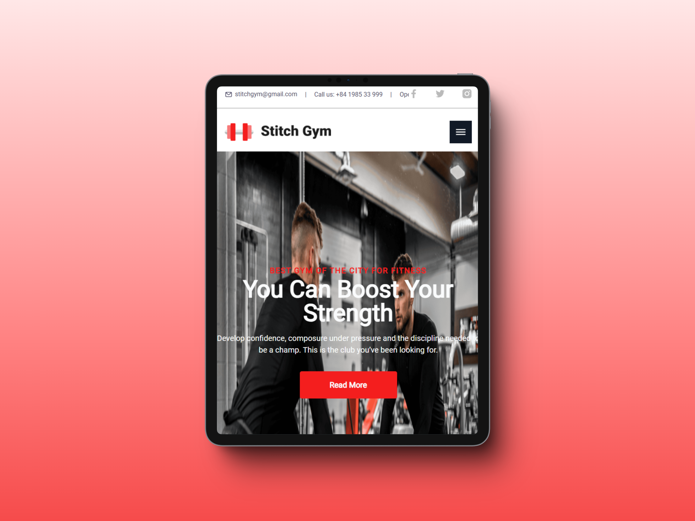
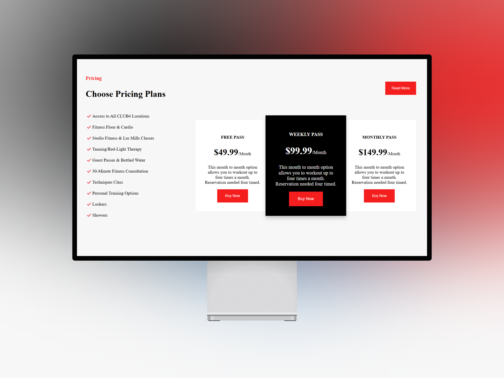

# Activity HTML & CSS - Sprint 1

> **Group members**
1. Alexandra Ríos
2. Sebastian Marat Urdanegui Bisalaya

# Instructions of the project
Mike is a junior developer who has been working on a website for a gym. He built the hero section of the homepage, but he’s struggling with making his HTML more semantic and accessible. He needs your help to refactor his code and create a navigation menu that follows best practices for both semantics and accessibility.

[Here is de design](https://www.figma.com/design/8tDpPbEXhvzD1UHVJ9dRnu/Hero-36?node-id=1-145&t=wHm1zyFGnYVzfI3t-0)

# Preview of Task 1 - Gym Store

[Clic aquí para ir al proyecto](https://github.com/SebastianUrdaneguiBisalaya/1-activity-html-css-sprint-1/tree/main/HeroSection)

# Preview of Task 2 - Price Section
[Clic aquí para ir al proyecto](https://github.com/SebastianUrdaneguiBisalaya/1-activity-html-css-sprint-1/tree/main/PriceSection-Ult.%20Versi%C3%B3n)

